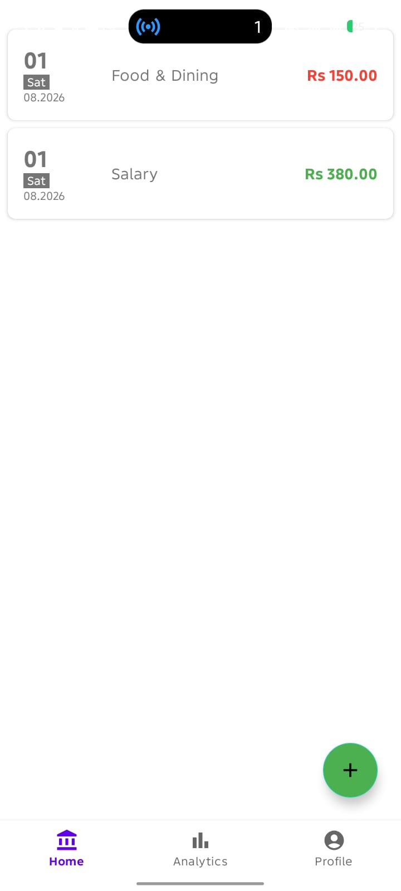
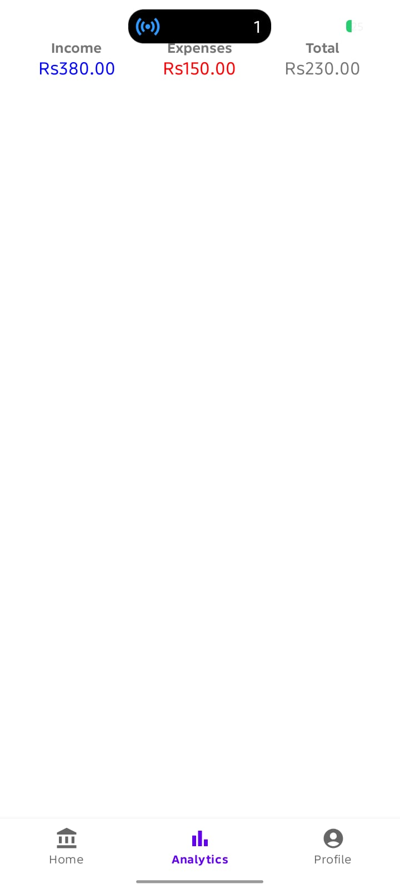
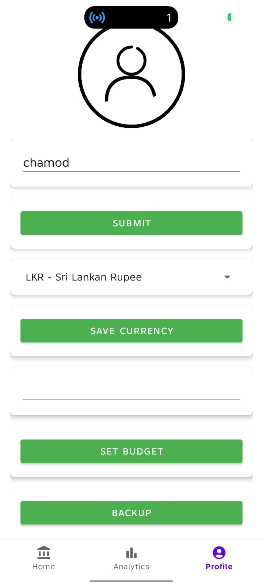

# Cashly

Cashly is an Android finance tracker for recording income and expenses, reviewing transaction history, checking analytics, and managing basic user preferences such as name, currency, and budget.

## Features

- Splash screen with first-run routing.
- Three-step onboarding flow.
- Initial user setup for name and base currency.
- Home dashboard with a transaction list.
- Add income flow.
- Add expense flow.
- Transaction detail view with delete support.
- Analytics screen with total income, expenses, and balance.
- Profile screen for editing name, currency, and budget.
- Backup and restore of transactions.

## Data Storage

Cashly uses two storage layers:

- Room database for transaction records.
- SharedPreferences for lightweight user settings such as preferred name, currency, currency symbol, budget, and onboarding completion.

### Database Choice

The chosen database is Room.

- Database name: `finance_tracker_db`
- Primary table: `transactions`
- Entity: `Transaction`

Room is used for persistent transaction storage because it gives type-safe access to the local SQLite database and integrates cleanly with LiveData and ViewModel.

### Backup and Restore

Transactions can be backed up and restored as JSON through the app-private internal storage using `backup.json`.

## Technology Stack

- Kotlin
- AndroidX
- Room
- LiveData
- ViewModel
- View Binding
- Material Components
- Gson
- Lottie

## App Flow

1. Launch the app.
2. The splash screen checks whether initial setup is complete.
3. New users are routed through onboarding, then name and currency setup.
4. Returning users go directly to the bottom navigation dashboard.
5. Users can add income or expense transactions from the home screen.
6. Users can review transaction details, delete entries, view analytics, and manage profile settings.

## UI Preview

| Screen | Preview |
| --- | --- |
| Splash screen |  |
| Onboarding 1 |  |
| Onboarding 2 |  |
| Onboarding 3 |  |
| Name setup |  |
| Currency selection |  |
| Home |  |
| Analytics |  |
| Profile |  |

## Project Structure

- `app/src/main/java/com/example/cashly/logo` - splash screen.
- `app/src/main/java/com/example/cashly/onboardscreens` - onboarding screens.
- `app/src/main/java/com/example/cashly/startinguserprefs` - initial setup screens.
- `app/src/main/java/com/example/cashly/navigation` - bottom navigation and main app screens.
- `app/src/main/java/com/example/cashly/transactionfragments` - add income and expense screens.
- `app/src/main/java/com/example/cashly/database` - Room database and repository.
- `app/src/main/java/com/example/cashly/dao` - transaction DAO.
- `app/src/main/java/com/example/cashly/models_entity` - Room entity models.
- `app/src/main/java/com/example/cashly/utils` - shared preferences and file backup helpers.

## Build Notes

- `minSdk`: 24
- `compileSdk`: 35
- `targetSdk`: 35
- View Binding is enabled.

## Getting Started

1. Open the project in Android Studio.
2. Let Gradle sync complete.
3. Run the `app` module on an Android device or emulator.
